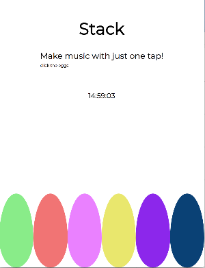
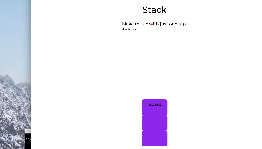

# stackmusic
## Visualizing user's action

Each egg icon has it's own sound track. 
On click the egg plays it's individual sound track and lets the user stack sounds both visually and physically.

A block is created by the user's activity. Each block matches the color of it's egg. 
Stack also offers a clock so the user can check time while indulging in the creative activiy.

## How to use the app
-Git clone and open HTML.

Or simply access it through this URL
-https://fituesliri.github.io/stackmusic/

The user can control their experience by tapping the eggs as many time as they want.
Hope you enjoy this experience. 

## Overview

This was my first HTML + Javascript + CSS experience.
There are a lot of points to improve but as a beginner to the languages I tried to keep it simple and understandable.
